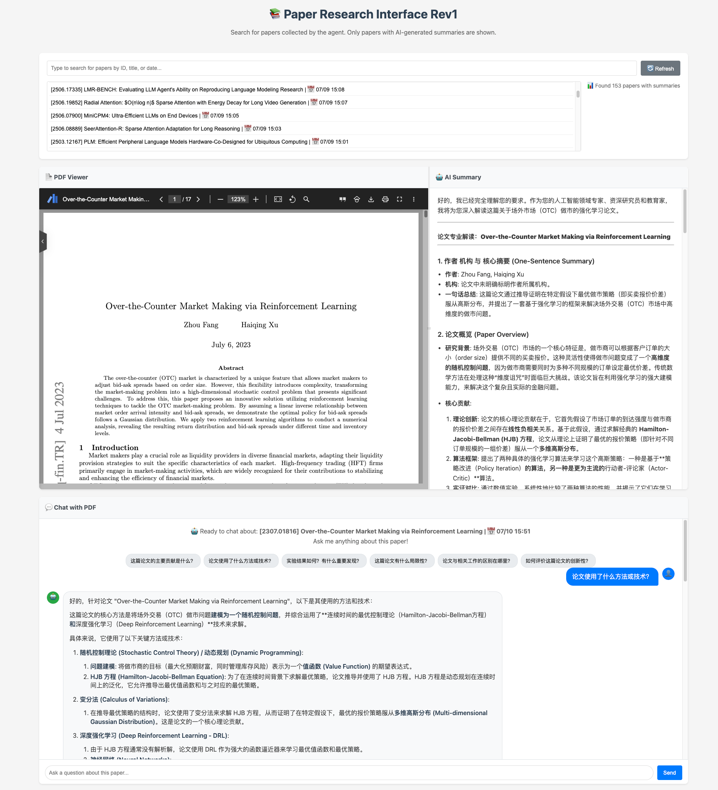

# Nana 项目：论文研究助手



本工具是 Nana 项目的其中一个核心功能，一个旨在简化和自动化科研流程的智能助手。

它能够接收一个论文标题列表，自动在线查找论文的详细信息（如 arXiv ID 和 PDF 链接），然后利用大语言模型（LLM）来生成结构清晰、内容详尽的专业摘要。所有结果都将通过一个简洁的 Web 界面进行展示，方便您随时查阅。

## 功能特性

- **自动论文信息获取**：仅需提供标题，即可自动查找论文的详细信息。
- **AI 驱动的论文摘要**：利用大语言模型深入阅读 PDF，并根据可配置的模板生成结构化的专业解读。
- **持久化缓存**：自动将成功处理的论文及其摘要保存在本地，避免重复工作和开销。
- **Web 交互界面**：通过 Gradio 构建了简单易用的浏览器界面，让您可以方便地搜索、并排查看论文原文和 AI 生成的摘要。
- **灵活配置**：通过 `config.yaml` 文件，可以轻松配置 API 密钥和为不同任务选择不同的大语言模型。
- **结构化日志**：在终端输出带有颜色和级别的日志，清晰地展示代理的运行状态和每一步操作。

## 快速开始

请遵循以下步骤在您的本地环境中运行本项目。

### 环境要求

- Python 3.9 或更高版本
- 一个大语言模型（LLM）提供商的 API 密钥（例如 [OpenRouter](https://openrouter.ai/)）

### 1. 安装

首先，将项目代码克隆到您的本地机器。强烈建议您使用 Python 虚拟环境。

```bash
# 进入项目目录
cd nana

# 创建并激活虚拟环境 (推荐)
python -m venv venv
source venv/bin/activate  # Windows 用户请使用 `venv\Scripts\activate`

# 安装所需依赖
pip install -r requirements.txt
```

### 2. 配置

本项目使用 `config.yaml` 文件来管理 API 密钥和模型偏好。为了简化配置，我们提供了一个模板文件。

1.  **重命名模板文件**：
    在 `config/` 目录下, 将 `config.template.yaml` 重命名为 `config.yaml`。

2.  **添加您的 API 密钥**：
    打开新的 `config/config.yaml` 文件，将文件中的 API 密钥占位符 (`"sk-or-v1-YOUR_OPENROUTER_API_KEY"`) 替换为您自己的密钥。您也可以在该文件中自定义不同代理任务所使用的模型。

## 使用说明

整个工作流程分为两个主要步骤：首先运行代理来收集和分析论文，然后启动 Web 界面来查阅结果。

### 第一步：运行研究代理

代理会读取一个输入文件中的论文标题列表，处理它们，并保存结果。

1.  **创建输入列表**：
    在 `agents/` 目录下创建一个名为 `paper_search_agent.in` 的文件。如果该文件不存在，代理在首次运行时会自动为您创建一个包含示例内容的文件。

2.  **添加论文标题**：
    打开 `agents/paper_search_agent.in` 文件，在其中添加您想要研究的论文标题，每行一个。例如：
    ```
    Toolformer: Language Models Can Teach Themselves to Use Tools
    ReAct Meets ActRe: When Language Agents Enjoy Training Data Autonomy
    ```

3.  **执行代理**：
    在项目根目录下运行以下命令：
    ```bash
    python agents/paper_search_agent.py
    ```
    代理会在终端中打印出详细的日志，并将所有结果保存在 `storage/paper_search_agent/cache.json` 文件中。

### 第二步：通过 Web 界面查看结果

当代理完成数据收集后，您可以启动 Web 界面来查看。

1.  **启动 Web 服务**：
    在项目根目录下运行以下命令：
    ```bash
    python pages/paper_search_agent/app.py
    ```

2.  **打开交互界面**：
    终端会显示一个本地网址（例如 `http://127.0.0.1:7860`）。在您的浏览器中打开这个链接，您就可以搜索已收集的论文，并方便地并排查看 PDF 原文和 AI 生成的摘要了。
